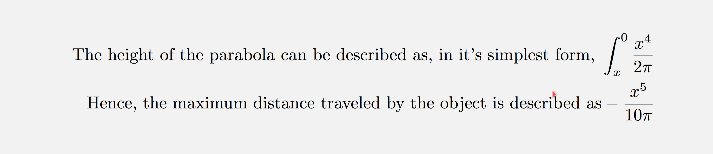

# Project Style Guide

This is a document so that I don't forget about the layout of my variables and functions that are widely used.

## Questions
Questions are a unique object, and are created using built-in generate_* functions.

### generate_*****()
Generation functions should take no inputs, and have no return statement. They will always redefine the variables:
* question_raw
* question_aspects
* answer_raw
* answer_aspects

### question_raw
*question_raw* should be a single SymPy expression which can be solved to return the answer_raw.

### question_aspects
*question_aspects* should be a 2-level nested list, where all elements are either strings, or LaTeX expressions.

If the variable is LaTeX code, it should be wrapped in a tuple of length one.

#### Example

This question_aspects example...

` [['Solve', (\frac{x}{2}')], ['Hint: Use u-sub for', ('u = x^e')]] `

... would be displayed as roughly:

### answer_raw
*answer_raw* should be a SymPy expression, which is at the correct simplification level as an answer to *question_raw*.

 Note this does not strictly mean the most simple form.

 Where there is more than one answer (e.g. quadratic), *answer_raw* should be a list of length 2 or more.

 If there is more than one valid answer (e.g. word question), this variable is not to be used.

 ### answer_aspects
 *answer_aespects* follows identical rules to *question_aspects*, including all prefacing text.

 #### Example 1

 `[[('x = 1')]]`

 

 #### Example 2

 `[['The height of the parabola can be described as, in it's simpliest form,', ('\int_{x}^{0} \frac{x^4}{2\pi}')], ['Hence, the maximum distance traveled by the object is described as', ('-\frac{x^5}{10\pi}')]]`

  
